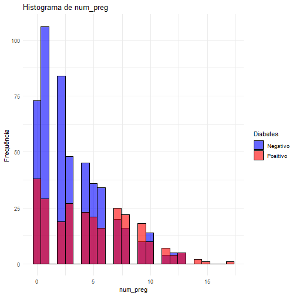
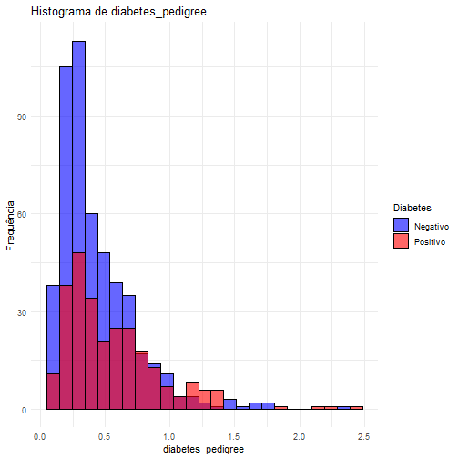
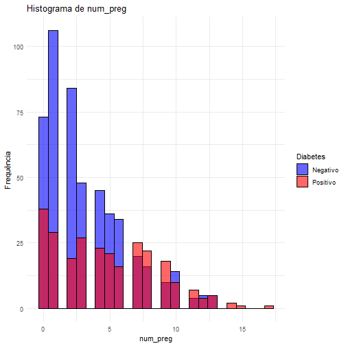

# Exercício 1

## Análise de Dados de Saúde com Modelos Descritivos e Explicativos

**Objetivo:** O objetivo deste projeto é realizar uma análise exploratória e descritiva de um conjunto de dados relacionados à saúde, utilizando a linguagem R. As tarefas são: identificar padrões, tendências e possíveis associações entre as variáveis do dataset, aplicando modelos descritivos e explicativos.

**Descrição:** Você deve selecionar um conjunto de dados de saúde, como por exemplo, um dataset contendo informações de pacientes com doenças crônicas, como diabetes, hipertensão, ou doenças cardíacas. A análise deverá incluir:

1. **Leitura e Pré-processamento do Dataset:** Carregue o dataset em R, explore suas características básicas e realize o pré-processamento necessário (tratar valores ausentes, normalizar variáveis, etc.).

2. **Análise Descritiva:** Use estatísticas descritivas para entender a distribuição das variáveis do dataset, incluindo medidas de tendência central (média, mediana) e de dispersão (desvio padrão, quartis).
Visualização dos Dados: Crie gráficos para visualizar a distribuição dos dados e identificar padrões, como histogramas, boxplots e gráficos de dispersão.

3. **Modelos Explicativos:** Aplique modelos explicativos (como regressão linear, logística ou árvores de decisão) para entender a relação entre as variáveis do dataset. Por exemplo, você pode investigar se a idade e o IMC estão associados ao risco de diabetes.

4. **Verificação de Associações:** Realize testes estatísticos para verificar a existência de associações significativas entre variáveis, como o teste qui-quadrado para variáveis categóricas ou a correlação de Pearson para variáveis numéricas.

5. **Interpretação dos Resultados:** Interprete os resultados obtidos a partir das análises e modelos aplicados, discutindo a significância e as implicações das descobertas.

## Exemplo

## Carregando os pacotes


``` r
library(tidyverse)
library(ggplot2)
library(caret)
library(RCurl)
library(GGally)
library(dplyr)
```
## Leitura do dataset.

Exemplo: Pima Indians Diabetes dataset, obtido pelo [Kaggle](https://www.kaggle.com/datasets/uciml/pima-indians-diabetes-database). Pode ser substituído por outro dataset relacionado à saúde.


``` r
url <- "https://raw.githubusercontent.com/jbrownlee/Datasets/master/pima-indians-diabetes.data.csv"
data_content <- getURL(url)
data <- read.csv(text = data_content, header = FALSE)

# Definindo os nomes das colunas
colnames(data) <- c('num_preg', 'glucose', 'blood_pressure', 'skin_thickness', 'insulin', 'bmi', 'diabetes_pedigree', 'age', 'diabetes')

# Examinando as primeiras linhas do dataset
head(data)
```

```
##   num_preg glucose blood_pressure skin_thickness insulin  bmi diabetes_pedigree age
## 1        6     148             72             35       0 33.6             0.627  50
## 2        1      85             66             29       0 26.6             0.351  31
## 3        8     183             64              0       0 23.3             0.672  32
## 4        1      89             66             23      94 28.1             0.167  21
## 5        0     137             40             35     168 43.1             2.288  33
## 6        5     116             74              0       0 25.6             0.201  30
##   diabetes
## 1        1
## 2        0
## 3        1
## 4        0
## 5        1
## 6        0
```

## Limpeza dos dados


``` r
data <- data %>%
  mutate(across(c("glucose", "blood_pressure", "skin_thickness", "insulin", "bmi"), 
                 ~ ifelse(. == 0, NA, .)))
```

## Análise Descritiva


``` r
summary(data)
```

```
##     num_preg         glucose      blood_pressure   skin_thickness     insulin      
##  Min.   : 0.000   Min.   : 44.0   Min.   : 24.00   Min.   : 7.00   Min.   : 14.00  
##  1st Qu.: 1.000   1st Qu.: 99.0   1st Qu.: 64.00   1st Qu.:22.00   1st Qu.: 76.25  
##  Median : 3.000   Median :117.0   Median : 72.00   Median :29.00   Median :125.00  
##  Mean   : 3.845   Mean   :121.7   Mean   : 72.41   Mean   :29.15   Mean   :155.55  
##  3rd Qu.: 6.000   3rd Qu.:141.0   3rd Qu.: 80.00   3rd Qu.:36.00   3rd Qu.:190.00  
##  Max.   :17.000   Max.   :199.0   Max.   :122.00   Max.   :99.00   Max.   :846.00  
##                   NA's   :5       NA's   :35       NA's   :227     NA's   :374     
##       bmi        diabetes_pedigree      age           diabetes    
##  Min.   :18.20   Min.   :0.0780    Min.   :21.00   Min.   :0.000  
##  1st Qu.:27.50   1st Qu.:0.2437    1st Qu.:24.00   1st Qu.:0.000  
##  Median :32.30   Median :0.3725    Median :29.00   Median :0.000  
##  Mean   :32.46   Mean   :0.4719    Mean   :33.24   Mean   :0.349  
##  3rd Qu.:36.60   3rd Qu.:0.6262    3rd Qu.:41.00   3rd Qu.:1.000  
##  Max.   :67.10   Max.   :2.4200    Max.   :81.00   Max.   :1.000  
##  NA's   :11
```

## Gerar o histograma com ggplot2 e facet_wrap


``` r
# Iterar sobre as colunas de interesse
for (column in colnames(data)) {
  # Verificar se a coluna é do tipo numérico
  if (is.numeric(data[[column]])) {
    # Criar o histograma
    p <- ggplot(data, aes_string(x = column, fill = factor(data$diabetes, labels = c("Negativo", "Positivo")))) +
      geom_histogram(bins = 25, alpha = 0.6, position = "identity", color = "black") +
      labs(title = paste("Histograma de", column),
           x = column,
           y = "Frequência") +
      theme_minimal() +
      scale_fill_manual(values = c("blue", "red"), name = "Diabetes")
    
    # Exibir o gráfico
    print(p)
  }
}
```



```
## Warning: Removed 5 rows containing non-finite outside the scale range (`stat_bin()`).
```


```
## Warning: Removed 35 rows containing non-finite outside the scale range (`stat_bin()`).
```


```
## Warning: Removed 227 rows containing non-finite outside the scale range (`stat_bin()`).
```


```
## Warning: Removed 374 rows containing non-finite outside the scale range (`stat_bin()`).
```


```
## Warning: Removed 11 rows containing non-finite outside the scale range (`stat_bin()`).
```



## Gráfico de dispersão


``` r
# Criando o gráfico ggpairs para todas as variáveis
ggpairs(data, 
        title = "Gráfico de Dispersão de Todas as Variáveis",
        aes(color = factor(diabetes), alpha = 0.5)) +
        theme_minimal()
```



# Modelo Explicativo

## Uso da regressão logística

``` r
model <- glm(diabetes ~ glucose + bmi + age, data=data, family=binomial)

summary(model)
```

```
## 
## Call:
## glm(formula = diabetes ~ glucose + bmi + age, family = binomial, 
##     data = data)
## 
## Coefficients:
##              Estimate Std. Error z value Pr(>|z|)    
## (Intercept) -9.032377   0.711037 -12.703  < 2e-16 ***
## glucose      0.035548   0.003481  10.212  < 2e-16 ***
## bmi          0.089753   0.014377   6.243  4.3e-10 ***
## age          0.028699   0.007809   3.675 0.000238 ***
## ---
## Signif. codes:  0 '***' 0.001 '**' 0.01 '*' 0.05 '.' 0.1 ' ' 1
## 
## (Dispersion parameter for binomial family taken to be 1)
## 
##     Null deviance: 974.75  on 751  degrees of freedom
## Residual deviance: 724.96  on 748  degrees of freedom
##   (16 observations deleted due to missingness)
## AIC: 732.96
## 
## Number of Fisher Scoring iterations: 4
```
## Calculando o Odds Ratio


``` r
round(exp(coef(model)),4)
```

```
## (Intercept)     glucose         bmi         age 
##      0.0001      1.0362      1.0939      1.0291
```

Os coeficientes obtidos representam a mudança no logaritmo da razão de chances (log-odds) da ocorrência de diabetes para cada unidade de aumento nas variáveis preditoras.

-	Intercept: O intercepto representa o log-odds da ocorrência de diabetes quando todas as variáveis independentes são iguais a zero.
- glucose: Cada unidade adicional no nível de glicose aumenta o log-odds de ter diabetes em `round(coef(model)["glucose"], 4)`. O valor-p associado indica que essa variável é altamente significativa.
- bmi: Cada unidade adicional no IMC aumenta o log-odds de ter diabetes em `round(coef(model)["bmi"], 4)`. Novamente, essa variável é estatisticamente significativa.
- age: Cada ano adicional de idade aumenta o log-odds de ter diabetes em `round(coef(model)["age"], 4)`.


## Teste de correlação entre glicose e idade


``` r
cor.test(data$glucose, data$age)
```

```
## 
## 	Pearson's product-moment correlation
## 
## data:  data$glucose and data$age
## t = 7.6472, df = 761, p-value = 6.208e-14
## alternative hypothesis: true correlation is not equal to 0
## 95 percent confidence interval:
##  0.1999508 0.3318200
## sample estimates:
##       cor 
## 0.2671356
```
A função cor.test em R realiza o teste de correlação e fornece:

1.	Coeficiente de Correlação de Pearson: Mede a força e a direção da relação linear entre duas variáveis. O valor varia de -1 a 1:

-	1: Correlação positiva perfeita.
- 0: Nenhuma correlação.
- -1: Correlação negativa perfeita.

2.	Valor-P (p-value): Avalia a significância estatística da correlação observada.

## Teste de associação entre glicose e presença de diabetes usando $\chi^2$


``` r
table_glucose_diabetes <- table(data$glucose > 120, data$diabetes)
chisq.test(table_glucose_diabetes)
```

```
## 
## 	Pearson's Chi-squared test with Yates' continuity correction
## 
## data:  table_glucose_diabetes
## X-squared = 123.35, df = 1, p-value < 2.2e-16
```
O teste $\chi^2$ (qui-quadrado) é utilizado para verificar se existe uma associação significativa entre duas variáveis categóricas. O comando chisq.test() em R realiza o teste $\chi^2$ e fornece informações sobre a independência entre as variáveis.

$\chi^2$ = 123.35: Esta é a estatística do teste $\chi^2$. Quanto maior o valor, maior a discrepância entre as frequências observadas e esperadas, sugerindo uma associação mais forte entre as variáveis.

Valor-P (p-value):

-	p-value = 0.0014: O valor-p indica a probabilidade de observar uma estatística de teste tão extrema quanto a observada, assumindo que as variáveis são independentes. Um valor-p pequeno (geralmente menor que 0.05) sugere que há evidências suficientes para rejeitar a hipótese nula de independência.

-	Se o valor-p for menor que 0.05: Existe uma associação significativa entre as variáveis. No exemplo, com um valor-p < 2.2e-16 podemos concluir que há uma associação estatisticamente significativa entre os níveis de glicose e a presença de diabetes. Isso sugere que a distribuição das variáveis não é independente e que níveis de glicose podem estar associados com a presença de diabetes.

-	Se o valor-p for maior que 0.05: Não há evidências suficientes para rejeitar a hipótese nula de independência. Isso indicaria que não há uma associação significativa entre as variáveis.

## Perguntas

1. Analisando visualmente os histogramas, é possível concluir que as variáveis possuem distribuição próxima de normal?

2. Analisando visualmente os gráficos de dispersão, é possível verificar quais variáveis apresentam correlação dois-a-dois?

